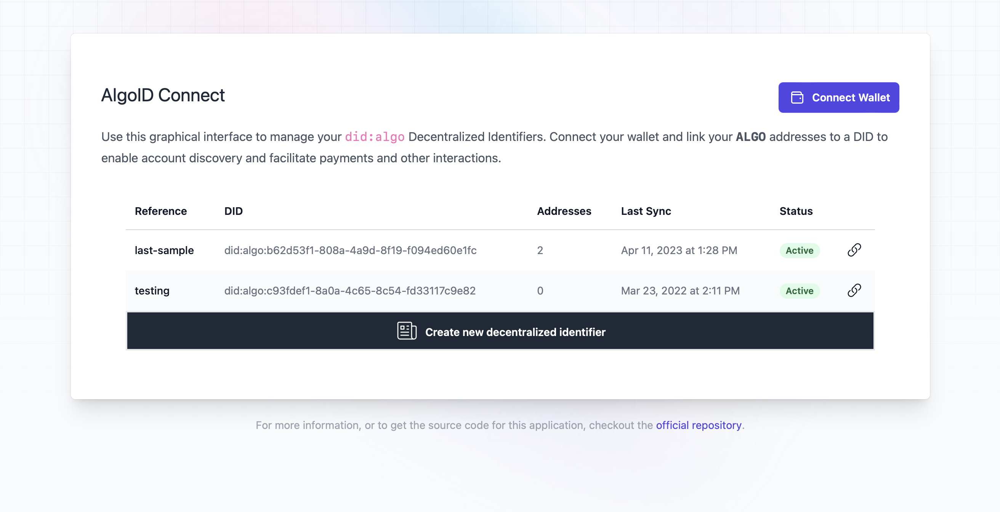

# AlgoID Connect UI (beta)

This application provides a simple GUI for interacting with your local AlgoID
Connect installation. The main features include:

- Creating and managing identities
- Connecting any WalletConnect-compatible wallet
- Linkining identities to ALGO addresses

To start the UI locally, run the following command:

```bash
algoid ui
```

> Once started, the application will be available at `http://localhost:8080`.

You can stop it at any time by pressing `Ctrl+C`.


